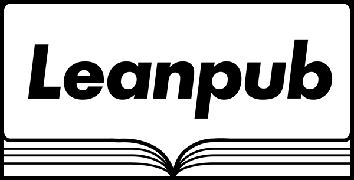

# Leanpub Book Format
This chapter discusses how to format a Leanpub book, and known issues with the current version of Leanpub.

## Code Samples
Chapters contain sections, which is where the bulk of your content should be.  A section contains text, and can include images and code samples.

This section will show how a code sample works.  Here is a code sample:

<<(code/sample1.rb)

Here is another sample:

<<[This Code Sample Has A Title](code/sample2.rb)

This text is after the code sample.

## Inserting Images
This section shows how you include an image.  Note that the names of the chapters and sections are not special.

That's it!

## Links Become Footnotes
We support Markdown syntax for links, as well as normal HTML links.  Both of these are converted into functioning footnotes in the PDF.  Here's an example of a link to [Leanpub](http://leanpub.com).

## Known Isssues

### Chapters Can't Have Footnotes

A chapter currently can't have footnotes, which means you can't put links in chapters since those get converted into footnotes.  (Yes, we're fixing that!  When it's fixed this document will be updated.)

### Code Samples Are A Bit Ugly

The formatting of code samples needs to be improved.
